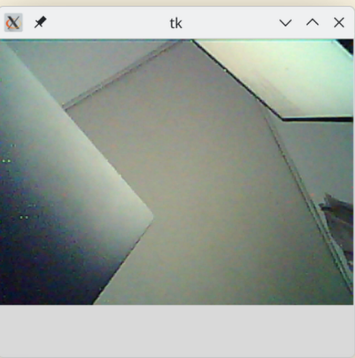

# GOOUUU esp32-s3-cam 图传

摄像头是 OV2640

# pin

# build
source ${IDF_PATH}/export.sh
idf.py menuconfig 去设置 SSID 和 passwd，可以键入 ‘/’ 去搜索配置
idf.py build

# format
git config core.hooksPath .githooks

# run
idf.py -p PORT flash

* wifi 配置
如果没有编译前配置默认的 CONFIG_WIFI_PASSWORD 和 CONFIG_WIFI_SSID, 需要用 ble app 配网。比如用 nRF Connect app
连接设备 esp32-cam, 找到 Unknown Service 下 uuid 是 b8a8da87-e141-3a8f-374d-0642b3ad54bf 的 Unknown Characteristic 。witer text 选项，发送 ssid 和 password 到 esp32 s3 ， ssid 和 password 用空格隔开，类似这样
"myssid password"。总的字符串长度不要超过63。
python view.py
